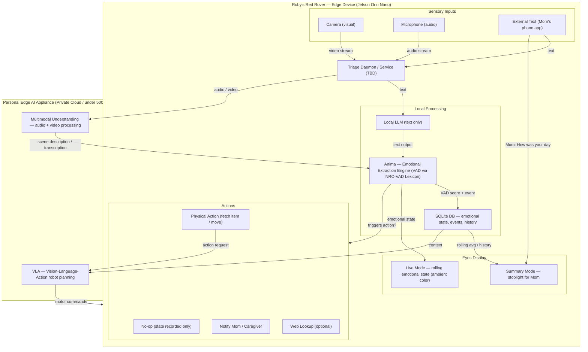

# Ruby's Red Rover

**An always-on emotion awareness system for the Innate MARS robot — built for people who communicate differently.**

Ruby's Red Rover gives MARS the ability to see a person, recognize who they are, read their emotional state, and remember how they've been feeling over time. It was designed from day one for people with cerebral palsy and other motor disabilities, where standard emotion detection fails because it mistakes involuntary muscle movements for emotional expressions.

This isn't a demo. It's a tool that watches, learns, and adapts — scanning more frequently when it detects distress, backing off when things are stable, and building a longitudinal mood record that caregivers and researchers can use.

Ruby is built around a continuous loop: **sense → understand → score → act**.

---

## What It Does

**Sees you.** MARS captures frames from its onboard RGBD camera.

**Knows you.** Local face recognition (on-device, no cloud) generates a 128-dimensional face embedding. If MARS has seen you before, it identifies you in milliseconds — no API call needed.

**Reads you.** The frame is sent to Google Gemini Vision with a prompt specifically tuned for people with motor disabilities. It distinguishes spasticity from anger, fatigue from sadness, motor frustration from emotional distress.

**Remembers you.** Every observation is logged — who, what emotion, what cues, when. The first time MARS meets someone, it asks their name. Every time after that, it knows.

**Shows you.** Colored Reachy Mini LEDs on top of MARS act as Ruby's **mood ring**. Walk into the room and get an instant vibe check — no screen, no app, just color.

| Color | Meaning |
|---|---|
| Warm yellow | Happy |
| Soft green | Content |
| Calm blue | Relaxed |
| Lavender | Neutral |
| Deep blue | Sad |
| Muted purple | Tired |
| Amber-orange | Stressed |
| Red (pulsing) | In pain |
| Red-orange (pulsing) | Frustrated |

Mom walks in at 3pm. The lights are soft green. She knows Ruby's having a good afternoon — without asking, without interrupting.

**Tells you.** Ask MARS "how was Ruby's day?" and it generates a natural language summary from the mood log:

> *"Ruby was mostly content today (68% of readings). There were 3 readings showing concern (frustrated, tired), starting around 2:15pm. Mood changed 4 times throughout the day. Last reading at 4:30pm: happy."*

**Adapts.** The scan frequency adjusts in real time:

| State | Scan Interval | Why |
|---|---|---|
| No one in frame | 10s | Save resources |
| Stable mood (3+ same readings) | 30s | Nothing to catch |
| Mood just changed | 10s | Track the shift |
| Distress detected | 5s | Don't miss anything |

**Acts.** When Ruby's emotional state warrants a response, MARS can:

| Action | When |
|---|---|
| No-op | State recorded, no intervention needed |
| Physical action | Fetch an item, move closer, offer comfort object |
| Notify caregiver | Alert Mom or PCA via text/app |
| Web lookup | Search for activity suggestions or calming resources |

---

## Architecture

### What's Running Today

```
                    MARS Robot (Jetson Orin Nano 8GB)
                    ================================

  RGBD Camera
      │
      v
  ┌─────────────────────────────────────────────────┐
  │  EmotionMonitor (always-on loop)                │
  │                                                  │
  │  FAST PATH (on-device, free, instant)           │
  │  Frame ──> inspireface                           │
  │              ├─ Face ID (who is this?)           │
  │              └─ Basic emotion                    │
  │                                                  │
  │  DEEP PATH (cloud, CP-aware, on mood change)    │
  │  Frame ──> Gemini Vision API                     │
  │              └─ "Is that grimace pain or         │
  │                  spasticity? Fatigue or sadness?" │
  │                    │                             │
  │                    v                             │
  │              PersonRegistry (SQLite)             │
  │              mood logged + adaptive timing       │
  │                    │                             │
  │                    v                             │
  │              MoodRing (Reachy Mini LEDs)         │
  │              "Ruby's ambient mood ring"          │
  └─────────────────────────────────────────────────┘
```

**Two-tier detection.** inspireface (already on MARS) handles face identity and basic emotion entirely on-device — zero API calls, zero latency. Gemini is only called when the mood changes or distress is detected, for CP-aware nuance that standard models miss. This cuts API usage by ~80% while keeping the deep analysis where it matters.

### Full Vision



The full vision adds audio/microphone input, a local LLM for text processing, the Anima emotional extraction engine (VAD scoring), an Edge AI Appliance for multimodal understanding, and VLA for physical robot actions. Today's implementation covers the vision path end-to-end; the diagram above shows where everything else plugs in.

---

## CP-Aware Emotion Detection

Standard emotion detection systems are trained on neurotypical expressions. They see spasticity and label it anger. They see fatigue and call it sadness. For someone with cerebral palsy, that's worse than useless.

Ruby's Red Rover prompts the vision model to:

- Distinguish involuntary muscle movements from emotional expressions
- Look beyond facial muscles — body tension, breathing, eye engagement
- Separate motor frustration from emotional distress
- Recognize fatigue and pain as distinct states, not subcategories of "sad"
- Include extended emotion labels: `in_pain`, `uncomfortable`, `frustrated`, `relaxed`

This isn't perfect. Vision models still have bias. But it's a starting point that acknowledges the problem instead of ignoring it.

---

## Red Rover — Mom's App

Red Rover is the companion web app that lets Mom (or any authorized caregiver) check on Ruby from her phone.

- Live mood ring — matches the physical LEDs on MARS
- "Where's Ruby?" — presence status at a glance
- "Find My Ruby" — activates beacon lights/sounds on the robot
- Today's mood timeline — every reading, with context
- Day summary — natural language narrative ("Ruby was mostly content today...")
- Access management — powered by Bolo grants (coming soon in UI)

**Live:** [https://red-rover-650440848480.us-central1.run.app](https://red-rover-650440848480.us-central1.run.app)

Login: `mom@redrover.bot` / `Ruby2026!`

Red Rover talks to MARS through the Bolo relay. Deployed on GCP Cloud Run (same project as the Bolo API).

Source: sibling repo `rubysredrover-app/`

---

## Bolo Integration — Who Can Check On Ruby

[Bolospot](https://bolospot.com) is the trust layer. Mom controls who can access Ruby's data — PCA Jane gets `mood:read` + `location:status`, Grandma gets `mood:read` only. At runtime, every skill checks Bolo before returning data. Non-transitive: if Mom grants Jane access, Jane can't pass it along.

See [BOLO.md](BOLO.md) for scopes, grant examples, runtime checks, and environment variables.

---

## Project Structure

```
rubysredrover/                          # MARS robot code
├── run.py                              # entry point (monitor + API server)
├── deploy.sh                           # one-command deploy to MARS
├── register_widget.js                  # register MARS as Bolo widget
├── requirements.txt
├── MARS_SETUP.md                       # what's on the robot, deploy steps, built with
├── ENGINEER.md                         # database schema, Python API for consuming emotion data
├── BOLO.md                             # Bolo trust & permissions — scopes, grants, runtime checks
├── skills/                             # → ~/skills/ on robot (BASIC auto-discovers)
│   ├── check_mood.py                   # "How is Ruby feeling?"
│   ├── day_summary.py                  # "How was Ruby's day?"
│   └── find_ruby.py                    # "Where's Ruby?" + beacon
└── emotion_tracker/                    # → ~/emotion_tracker/ on robot
    ├── camera.py                       # ROS2 topic subscriber (innate-os native)
    ├── detector.py                     # abstract EmotionDetector interface
    ├── gemini_detector.py              # CP-aware deep analysis (Gemini)
    ├── face_encoder.py                 # inspireface on-device (face ID + basic emotion)
    ├── person_registry.py              # SQLite: people + embeddings + mood log
    ├── monitor.py                      # always-on, two-tier, adaptive timing
    ├── mood_ring.py                    # Reachy Mini LED mood colors
    ├── mood_summary.py                 # "how was Ruby's day?" narratives
    ├── find_ruby.py                    # presence tracking + beacon + text Mom
    ├── bolo_guard.py                   # Bolo permission checks (runtime)
    └── api.py                          # HTTP API for Red Rover (port 8080)

rubysredrover-app/                      # Red Rover — Mom's web app
├── src/App.tsx                         # React UI
├── src/App.css                         # Dark theme, mobile-first
└── ...                                 # Vite + TypeScript
```

---

## Getting Started

See [MARS_SETUP.md](MARS_SETUP.md) for deploy steps, hardware specs, and what's on the robot. See [ENGINEER.md](ENGINEER.md) for the Python API and database schema.

---

## Future

### On-Device Inference

The architecture is ready. When you want to stop calling the cloud:

1. Create `local_detector.py` implementing `EmotionDetector`
2. Load your model on the Jetson GPU (TensorRT, ONNX, whatever)
3. In `run.py`, swap `GeminiDetector()` for `LocalDetector()`
4. Everything else stays the same

Zero bandwidth. Zero latency. Zero API cost. Same interface.

### Anima Engine (Text-Based Emotion)

[Anima](https://github.com/brainwavecollective/anima-engine) is a two-loop emotion extraction engine for text input. It could complement vision-based detection by analyzing Ruby's *words* alongside her facial cues — especially valuable when CP makes facial expressions unreliable. Face + voice + text = three signals triangulating on the truth.

### Audio Input

The full architecture includes microphone as a sensory input — voice tone, cadence, and verbal content as another signal channel. Combined with vision and text, three modalities triangulate on emotional state more reliably than any one alone.

---

*Built at the Google DeepMind Hackathon, April 2026.*
