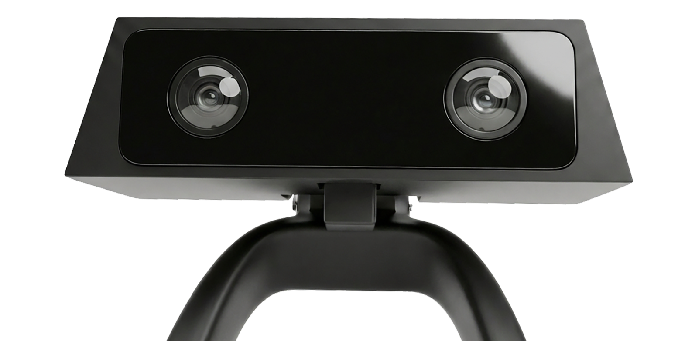

<div align="center">


# Ruby's Red Rover

### When Ruby is hurting, she can't tell you.<br>So we built a robot that can see it.

<br>

[](https://rubysredrover.com)
&nbsp;
[](https://innate.ai)
&nbsp;
[](https://ai.google.dev)

<br>

**[▶ Watch the pipeline demo](monitoring/demo_walkthrough.html)** &nbsp;·&nbsp; **[📊 See the deck](mars-deck.html)** &nbsp;·&nbsp; **[🔧 Team profile](https://github.com/rubysredrover/.github/blob/main/profile/README.md)**

</div>

---

## The problem nobody's solving

Ruby knows exactly what she wants. Ordering food. Having a conversation. Making a film. But the world struggles to hear her — and the AI we've built hears her worst of all.

Cerebral palsy means her body doesn't match her mind. She grimaces from muscle tension, not anger. Her responses are slow because of motor fatigue, not disengagement. She stims when she's *happy*, not stressed. Every off-the-shelf emotion model reads her completely wrong.

**Ruby's Red Rover is the first emotion system that reads her correctly.**

---

## What it does

MARS — Ruby's robot companion — watches continuously, understands what it's seeing, and tells her mom when something's off. Not by guessing. By knowing Ruby specifically.

| | |
|---|---|
| 👀 **Sees her** | RGBD camera, on-device face recognition via InspireFace |
| 🧠 **Knows her** | 128-dim face embeddings stored locally, identified in 50ms |
| 💛 **Reads her correctly** | Gemini 2.5 Flash with CP-aware prompting — distinguishes spasticity from anger, stimming from distress |
| 📊 **Scores her** | Ruby Score (0-100): eye contact + volume + response speed, calibrated to *her* baseline, not a population |
| 🌈 **Shows her mood** | Reachy Mini eye LEDs glow with her emotional state — ambient, no screen needed |
| ⚡ **Adapts** | 5s scans during distress, 30s when stable — the loop auto-paces |
| 📲 **Alerts mom** | Sustained declines or rapid drops push through Bolo with full revocable consent |

---

## The results

In side-by-side testing, a standard emotion model misreads Ruby. Same frame, same pose. The CP-aware pipeline gets it right.

> **Generic model:** *"stressed"* — muscle tension detected.
>
> **Ruby's Red Rover:** *"happy"* — stimming + eye contact + vocalization. Tension is motor, not emotional.

Try it yourself with the [pipeline walkthrough](monitoring/demo_walkthrough.html) — drop in any video, compare CP-aware analysis against a neurotypical baseline, watch the delta.

---

## How it's built

```
MARS Robot (Jetson Orin Nano, 8GB)
│
├── Fast path (on-device, ~50ms, zero network)
│   └── InspireFace → face ID + coarse emotion
│
├── Deep path (cloud, on-demand)
│   └── Gemini 2.5 Flash + CP-aware prompt (only on mood transitions or distress)
│
├── Ruby Score engine
│   └── Weighted model, retrains on-device from caregiver labels
│
├── PersonRegistry (SQLite)
│   └── Mood log, score history, face embeddings, audit trail
│
├── Mood Ring (Reachy Mini LED eyes)
│   └── Ambient color output driven by the current score
│
└── Red Rover API → Bolo widget
    └── Real-time mood + score + events, surfaced to caregivers through Bolo's permission layer
```

Full implementation in [`monitoring/`](monitoring/).

---

## What's in the repo

| Path | What's there |
|------|--------------|
| [`monitoring/emotion_tracker/`](monitoring/emotion_tracker/) | Perception loop, Ruby Score, mood ring, alert logic |
| [`monitoring/agents/`](monitoring/agents/) | `ruby_assistant` — the voice agent MARS uses to speak |
| [`monitoring/skills/`](monitoring/skills/) | On-device skills: check_mood, day_summary, find_ruby, wave_hello |
| [`monitoring/demo_walkthrough.html`](monitoring/demo_walkthrough.html) | Live pipeline demo with CP-aware vs. neurotypical comparison |
| [`mars-deck.html`](mars-deck.html) | Project pitch deck |

---

## The bigger picture

Ruby's Red Rover proves **why** we need a permission layer for AI agents. Every time MARS wants to act — order food, contact the PT, share Ruby's mood with grandma — it asks for consent through **[Bolospot](https://bolospot.com)**. Mom decides. Every grant is scoped, revocable, auditable.

MARS is the emotional story. Bolo is the infrastructure play.

---

## Built for

- **People whose expressions don't match the training data.** Cerebral palsy. Autism. Stroke recovery. ALS. Any motor profile that defeats generic affect models.
- **Caregivers** who need a trustworthy longitudinal record, not an app that panics at every motor tic.
- **The agent ecosystem** that's about to have a trust problem and doesn't know it yet.

---

## Partners

<div align="center">

&nbsp;&nbsp;&nbsp;&nbsp;

&nbsp;&nbsp;&nbsp;&nbsp;

&nbsp;&nbsp;&nbsp;&nbsp;

</div>

<br>

Built on [Innate](https://innate.ai) MARS with [Google Gemini](https://ai.google.dev/), [InspireFace](https://github.com/HyperInspire/InspireFace), [ElevenLabs](https://elevenlabs.io/), and [Pollen Robotics](https://pollen-robotics.com/) Reachy Mini. Winner of **Google DeepMind @ RoboHacks 2026.**

---

<div align="center">

### For Ruby.<br>And for everyone whose voice the world hasn't learned to hear yet.

</div>
