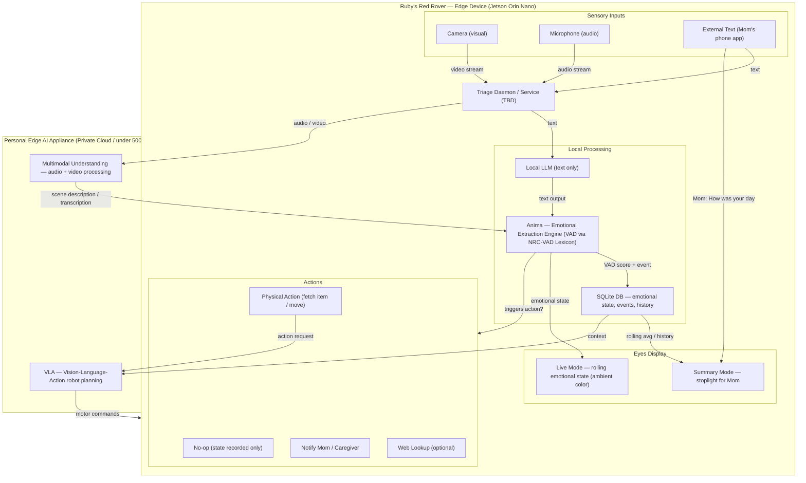

# Ruby's Red Rover 🤖

A sense-and-regulate companion robot designed to detect emotional states and respond with appropriate regulatory actions — think service dog for emotional regulation.

## Overview

Ruby is built around a continuous loop: **sense → understand → score → act**. Sensory inputs (visual, audio, text) are triaged, processed for emotional content using VAD (Valence-Arousal-Dominance) scoring, recorded, and responded to with calibrated actions. Ruby's eyes display the current emotional state in real time, and can switch into a summary mode to give Mom a quick "how was the day" stoplight readout.

## Architecture

## Key Components

### On-Device (Jetson Orin Nano)
- **Triage Daemon** — receives all sensory input and routes it for processing. Implementation TBD.
- **Local LLM** — lightweight text-only model for on-device inference
- **Anima** — emotional extraction engine, scores text using the NRC-VAD Lexicon for Valence, Arousal, and Dominance
- **SQLite** — local store for all emotional events, states, and history
- **Eyes** — RGB display reflecting live emotional state; switches to stoplight summary mode on demand

### Personal Edge AI Appliance (Private Cloud / <500w)
- **Multimodal Understanding** — handles audio and video processing beyond on-device capability; produces text descriptions fed back into Anima
- **VLA (Vision-Language-Action)** — robot action planning for physical responses in the environment

## Sense & Regulate Loop

1. Sensory input arrives (camera, mic, or external text from Mom's app)
2. Daemon triages and routes to local LLM (text) or Edge Appliance (audio/video)
3. All paths produce text, which is scored by Anima for VAD
4. Event + state recorded to SQLite
5. Eyes updated with current emotional color
6. Action determined: no-op, physical response, caregiver notification, or web lookup
7. On "How was your day?" — summary mode activated, eyes display stoplight from day's history

## Status

> 🚧 Early development — hackathon baseline. Architecture and component decisions are in flux.

## Open Questions / TBD

- [ ] Triage Daemon implementation (ROS2? custom Python service? other?)
- [ ] Local LLM model selection for Jetson Orin Nano
- [ ] Edge Appliance hardware finalization (currently private cloud placeholder)
- [ ] Mom's app interface design
- [ ] Action library — what physical responses does Ruby support?
